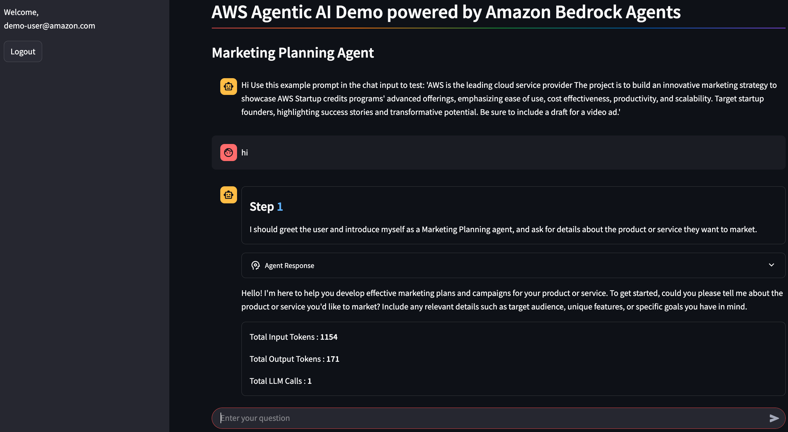
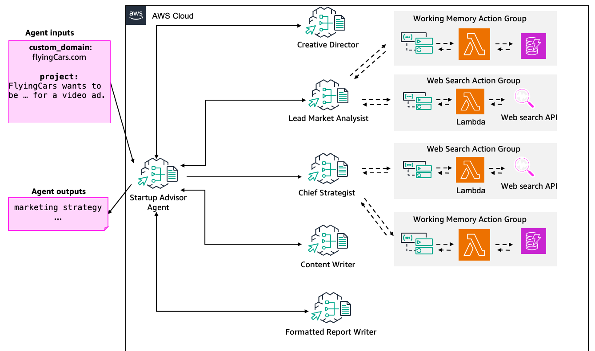

# Marketing Planning Agent with Streamlit UI



## Description

This project provides a complete solution for marketing planning using Amazon Bedrock Agents with a Streamlit web interface. It combines the power of generative AI with a user-friendly frontend to help marketing teams and startups create comprehensive marketing plans and conduct market research.

The application is built on a customized version of the [AWS Streamlit Deployment Framework](https://github.com/aws-samples/streamlit-deploy) and incorporates agent architecture from the [Amazon Bedrock Agent Samples](https://github.com/awslabs/amazon-bedrock-agent-samples).

## Key Features

- **Marketing Planning Agent**: Leverages multiple specialized sub-agents to create comprehensive marketing plans
- **Web-Based Interface**: User-friendly Streamlit UI for interacting with the agent
- **AWS Integration**: Seamless deployment on AWS using ECS, CloudFront, and CI/CD pipeline
- **Cognito Authentication**: Secure access control for the application
- **Web Search Capability**: Enables the agent to perform real-time market research using Tavily API

## Architecture

The application consists of three main components:

1. **Frontend**: Streamlit web application deployed on Amazon ECS with Fargate
2. **Backend**: Amazon Bedrock Agents with specialized knowledge bases and tools
3. **CI/CD Pipeline**: Automated deployment pipeline using AWS CodePipeline, CodeBuild, and CloudFormation

### Marketing Planning Agent Architecture

The Marketing Planning Agent uses a multi-agent collaboration approach with specialized sub-agents working together to create comprehensive marketing plans:



The agent system includes:
- **Lead Market Analyst**: Conducts market research and competitive analysis
- **Content Creator**: Generates initial marketing copy and content ideas
- **Chief Content Creator**: Refines and finalizes content for maximum impact
- **Chief Strategist**: Develops overall marketing strategy and campaign direction
- **Agent Storage Manager**: Manages knowledge and information flow between agents

This architecture enables the system to break down complex marketing planning tasks into specialized components, with each sub-agent focusing on its area of expertise.

### CI/CD Architecture


The CI/CD deployment process follows these steps:

1. Developer manually deploys the `codepipeline.yaml` stack, which includes the `infrastructure.yaml` as a nested stack
2. Lambda triggers the CodeBuild project
3. The CodeBuild project zips the repository content into an app.zip file
4. CodeBuild copies app.zip into an S3 bucket
5. The app.zip PUT event triggers CodePipeline and the CodeBuild stage
6. This CodeBuild creates a container image using the Dockerfile and pushes it to ECR
7. The Deploy stage is triggered
8. CloudFormation deploys the `deploy.yaml` stack with the new docker image URI
9. After successful creation of the stack, CloudFront invalidate cache stage is triggered
10. For future updates, developers customize the app, zip the new content, and upload it to Amazon S3, triggering the pipeline again

### Development Architecture


For local development, the application uses the Streamlit framework to provide a web interface that communicates with Amazon Bedrock Agents.

## Prerequisites

- An AWS Account with appropriate permissions
- AWS CLI configured with credentials
- Python 3.8+ for local development
- Tavily API key for web search functionality

## Deployment with CI/CD Pipeline

This option provides a complete CI/CD pipeline for continuous development and deployment.

1. **Clone the repository**
   ```bash
   git clone https://github.com/rkmaws/mktg-agent-streamlit-app.git
   cd mktg-agent-streamlit-app
   ```

2. **Deploy the CloudFormation stack**
   ```bash
   aws cloudformation create-stack --stack-name MarketingAgentStack --template-body file://cfn_stack/pipeline/codepipeline.yaml --capabilities CAPABILITY_IAM
   ```

3. **Prepare and upload the application code**
   
   After the CloudFormation stack is deployed, you need to prepare and upload the application code:

   ```bash
   # Commit any changes
   git add .
   git commit -m "All Changes"
   
   # Create a zip archive of the repository
   git archive --format=zip --output=app.zip HEAD
   
   # Upload the zip to the S3 bucket created by the CloudFormation stack
   # You can find the bucket name in the Outputs of the CloudFormation stack
   aws s3 cp app.zip s3://<CodeS3Bucket-Name>
   ```

4. **Deploy the Bedrock Agents**
   ```bash
   python3 src/marketing_planning_agent/main.py --recreate_agents "true"
   ```

5. **Create Cognito User**
   
   After the CodePipeline successfully completes:
   
   - Go to the AWS Cognito console
   - Find the user pool created by the CloudFormation stack
   - Navigate to "Users" and click "Create user"
   - Fill in the required information (email, password, etc.)
   - This user will be used to authenticate to the Streamlit application

6. **Accessing the Application**
   
   After the CodePipeline successfully completes:
   
   - Get the CloudFront URL from the `Output` of the stack named `<StackName>deploy`
   - Open the URL in your browser
   - Log in using the Cognito user credentials you created

## Local Development

1. **Set up virtual environment**
   ```bash
   python3 -m venv .venv
   source .venv/bin/activate
   pip install -r src/requirements.txt
   ```

2. **Deploy required tools**
   - Web Search tool: Follow instructions in `/src/shared/web_search/README.md` (requires Tavily API key)
   - Working Memory tool: Follow instructions in `/src/shared/working_memory/README.md`

3. **Run Streamlit locally**
   ```bash
   streamlit run app.py
   ```

## Usage Examples

The Marketing Planning Agent can help with various marketing planning tasks:

1. **Create a marketing plan for a new product**
   ```
   Create a marketing plan for our new cloud-based project management software targeting small businesses.
   ```

2. **Generate campaign ideas**
   ```
   Generate social media campaign ideas for our upcoming summer sale on outdoor equipment.
   ```

3. **Write marketing copy**
   ```
   Write email marketing copy for our new subscription service highlighting the key benefits.
   ```

4. **Conduct market research**
   ```
   Research the current trends in sustainable fashion and identify potential market opportunities.
   ```

## Customization

To customize the application for your specific needs:

1. Modify the Bedrock Agent configuration in `src/marketing_planning_agent/agents.yaml`
2. Update the UI configuration in `src/ui/config.py`
3. Edit the tasks configuration in `src/marketing_planning_agent/tasks.yaml` to customize agent behavior
4. Add additional tools or knowledge bases as needed

## Security Considerations

- The application uses Amazon Cognito for authentication
- Secrets are managed through AWS Systems Manager Parameter Store
- All communications are encrypted using HTTPS
- Follow AWS security best practices for production deployments

## Clean Up

To remove all deployed resources:

1. Delete the CloudFormation stacks
2. Clean up the Bedrock Agents:
   ```bash
   python3 src/marketing_planning_agent/main.py --clean_up "true"
   ```

## Contributing

Contributions are welcome! Please see the [CONTRIBUTING](CONTRIBUTING.md) file for details.

## License

This library is licensed under the MIT-0 License. See the [LICENSE](LICENSE) file.
